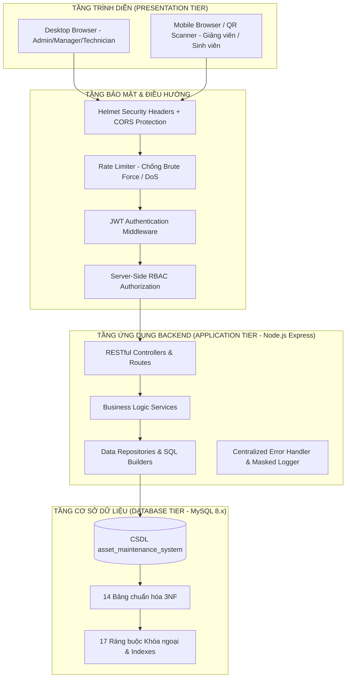
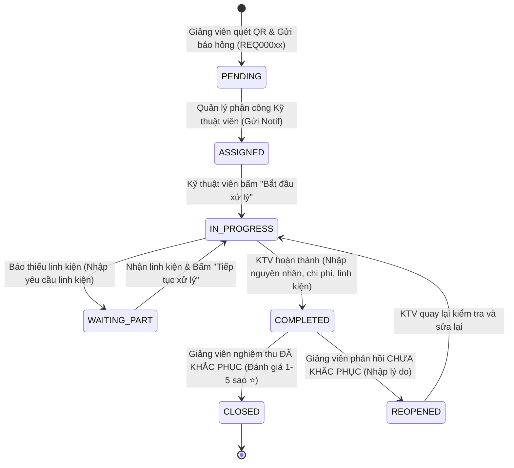

# HỆ THỐNG THÔNG TIN QUẢN LÝ TÀI SẢN VÀ BẢO TRÌ THIẾT BỊ — TRƯỜNG ĐẠI HỌC CÔNG NGHỆ GTVT (UTT)
> **University of Transport Technology (UTT) — Asset & Maintenance Management System with QR Code Integration**  
> 📘 **CẨM NANG HƯỚNG DẪN CÀI ĐẶT & CHẠY DỰ ÁN**: [`docs/huong-dan-chay-du-an.md`](docs/huong-dan-chay-du-an.md)

---

## 1. TỔNG QUAN DỰ ÁN (PROJECT OVERVIEW)

Hệ thống thông tin quản lý tài sản và bảo trì thiết bị là giải pháp phần mềm quản trị toàn diện (*Enterprise SaaS*), được nghiên cứu và thiết kế chuyên sâu dành riêng cho **Trường Đại học Công nghệ Giao thông Vận tải (UTT)**.

Hệ thống ứng dụng công nghệ **Mã QR Code độc bản** gắn liền trên từng tài sản phòng học (Máy chiếu, PC Lab, Màn hình tương tác, Thiết bị mạng Cisco, Điều hòa Inverter...), giúp rút ngắn tối đa thời gian báo hỏng từ **2 ngày xuống còn 30 giây**, tự động hóa 100% quy trình điều phối kỹ thuật viên, giám sát cam kết chất lượng dịch vụ (**SLA**) theo thời gian thực và đo lường sức khỏe kỹ thuật - tài chính của thiết bị (**Asset Health Analytics**).

---

## 2. CÁC TÍNH NĂNG CỐT LÕI (CORE FEATURES)

### 🏷️ 1. Quản Lý Danh Mục Tài Sản & Master Data (Modules 1, 4):
- Quản lý phân cấp: **Tòa nhà ➔ Tầng ➔ Vị trí phòng học ➔ Đơn vị quản lý ➔ Loại thiết bị ➔ Nhà cung cấp ➔ Thiết bị**.
- Lưu trữ đầy đủ hồ sơ kỹ thuật: Model, Số Serial, Ngày mua sắm, Nguyên giá, Thời hạn bảo hành, Trạng thái vận hành (`ACTIVE`, `MAINTENANCE`, `BROKEN`, `RETIRED`).
- Đánh giá sức khỏe thiết bị đa chỉ số: **Asset Health Score (0 - 100 điểm)** dựa trên 7 chỉ số vận hành và tài chính.

### 📱 2. Động Cơ Mã QR Code & Trang Tra Cứu Công Khai (Module 5):
- Mỗi thiết bị được cấp một chuỗi `qr_token` mã hóa ngẫu nhiên duy nhất (*Chống lộ thông tin nhạy cảm*).
- Sinh mã QR Base64 PNG HD, xem trước tem nhãn (*Print Label Preview*), tải ảnh PNG và in nhãn dán công nghiệp.
- **Trang tra cứu công khai Mobile-First (`/device/:token`)**: Giảng viên, sinh viên quét mã bằng camera điện thoại để xem ngay thông tin thiết bị, lịch sử sửa chữa và bấm nút **"Báo sự cố thiết bị"** tức thì.
- Tích hợp camera quét mã trực tiếp trong ứng dụng (`/qr-scanner`).

### 🛠️ 3. Quy Trình Báo Sự Cố & Vòng Đời Kỹ Thuật Viên (Modules 6, 7):
- Tự động sinh mã phiếu định danh tuần tự: `REQ00001`, `REQ00002`...
- Phân loại mức độ ưu tiên: `LOW` (72h), `MEDIUM` (24h), `HIGH` (8h), `URGENT` (4h).
- Luồng trạng thái kỹ thuật viên chuẩn hóa (State Machine):  
  $$\text{PENDING} \xrightarrow{\text{Assign}} \text{ASSIGNED} \xrightarrow{\text{Start}} \text{IN\_PROGRESS} \underset{\text{Resume}}{\overset{\text{Wait Part}}{\rightleftharpoons}} \text{WAITING\_PART} \xrightarrow{\text{Complete}} \text{COMPLETED}$$
- Kỹ thuật viên bắt buộc ghi nhận: Nguyên nhân gốc rễ (*Root cause*), Giải pháp khắc phục (*Resolution*), Danh mục vật tư thay thế (*Parts used*) và Chi phí thực tế (*Actual cost*).

### ⭐ 4. Nghiệm Thu Người Dùng 5 Sao & Đóng Phiếu (Module 8):
- Khi KTV hoàn thành, người báo sự cố (Giảng viên) nhận thông báo và vào nghiệm thu:
  - **"Đã khắc phục"**: Đánh giá sao (1-5 ⭐) + Ghi nhận xét ➔ Phiếu chuyển sang `CLOSED`, cập nhật máy về `ACTIVE`.
  - **"Chưa khắc phục"**: Nhập lý do phản hồi ➔ Phiếu chuyển sang `REOPENED` ➔ Gửi cảnh báo khẩn cấp cho KTV sửa lại.

### 📅 5. Quản Lý Bảo Trì Định Kỳ & Dự Đoán (Module 9):
- Thiết lập lịch kiểm tra theo chu kỳ: `MONTHLY`, `QUARTERLY`, `SEMI_ANNUALLY`, `ANNUALLY`, `CUSTOM`.
- Tự động tính toán ngày bảo dưỡng tiếp theo (`next_run_date`) từ dữ liệu thực tế.
- Bảng điều khiển cảnh báo phân màu 4 cấp độ: `UPCOMING` (Sắp đến hạn), `DUE` (Hôm nay), `OVERDUE` (Quá hạn), `COMPLETED` (Đã hoàn tất).

### 🔔 6. Trung Tâm Thông Báo Nội Bộ Real-Time (Module 10):
- Chuông thông báo đa vai trò trên thanh Header, đếm số lượng tin chưa đọc, đánh dấu đã đọc một chạm.
- Tự động quét và phát cảnh báo: Vé quá hạn SLA, Lịch bảo dưỡng đến hạn, Sự cố khẩn cấp, Thiết bị sắp hết hạn bảo hành.

### 📊 7. Bảng Điều Khiển Quản Trị & Biểu Đồ Thống Kê (Module 11):
- **8 Thẻ KPI tổng quan**: Tổng thiết bị, Máy hoạt động, Máy hỏng, Máy đang bảo trì, Phiếu chờ xử lý, Phiếu đang sửa, Phiếu quá hạn, Tổng chi phí bảo trì.
- **8 Biểu đồ phân tích chuyên sâu (Recharts)**:
  1. Số lượng sự cố theo 12 tháng gần nhất (Area Chart).
  2. Cơ cấu phiếu theo trạng thái (Donut Chart).
  3. Phân bổ phiếu theo mức độ ưu tiên (Pie Chart).
  4. Cơ cấu thiết bị theo loại máy (Bar Chart).
  5. Phân bổ thiết bị theo tòa nhà (Pie Chart).
  6. Biến động chi phí sửa chữa qua các tháng (Bar Chart).
  7. Top 10 thiết bị phát sinh sự cố nhiều nhất (Horizontal Bar).
  8. Top 5 vị trí phòng học xảy ra nhiều sự cố nhất (Bar Chart).
- Bộ lọc đa chiều: Khoảng ngày, Tòa nhà, Phòng học, Loại thiết bị, Trạng thái, Mức ưu tiên.

### 📑 8. Trung Tâm Báo Cáo & Xuất Dữ Liệu Excel / CSV (Module 12):
- **7 Mẫu báo cáo quản trị chuẩn Bộ Giáo dục & Đào tạo**:
  1. Báo cáo kiểm kê danh mục tài sản toàn trường.
  2. Báo cáo tổng hợp tình hình bảo trì & sự cố thiết bị.
  3. Báo cáo chi phí và phân bổ ngân sách sửa chữa.
  4. Báo cáo đánh giá hiệu suất kỹ thuật viên (KPI & SLA).
  5. Báo cáo phân tích tần suất hỏng hóc thiết bị.
  6. Báo cáo cảnh báo thời hạn bảo hành tài sản.
  7. Báo cáo theo dõi kế hoạch bảo trì định kỳ.
- Xem trước bảng dữ liệu phân trang, xuất file Excel định dạng màu chuẩn (`.xlsx` qua ExcelJS), xuất file CSV UTF-8 và hỗ trợ in ấn tối ưu khổ giấy A4.

### ⏱️ 9. Giám Sát Cam Kết Chất Lượng Dịch Vụ SLA (Module 13):
- Tính toán hạn chót `due_at` tự động từ máy chủ: `URGENT` (+4h), `HIGH` (+8h), `MEDIUM` (+24h), `LOW` (+72h).
- Đánh giá chỉ số vi phạm SLA `is_overdue`, cảnh báo sắp quá hạn `is_due_soon` (< 120 phút) và tỷ lệ tuân thủ `sla_compliance_rate`.

### 🩺 10. Phân Tích Tình Trạng Sức Khỏe Thiết Bị (Module 14):
- Đo lường 7 chỉ số kỹ thuật & tài chính: Số lần hỏng, Số lần bảo dưỡng, Tổng chi phí, Thời gian dừng máy (Downtime), Tuổi thọ máy, Chi phí trung bình, Tần suất sự cố/năm.
- Tính toán **Asset Health Score (0 - 100 điểm)** và phân loại 4 mức độ:
  - 🟢 **80 - 100**: `GOOD` (Tốt - Duy trì vận hành).
  - 🟡 **60 - 79**: `WARNING` (Cần lưu ý - Tăng cường kiểm tra).
  - 🟠 **40 - 59**: `RISK` (Nguy cơ cao - Thay thế linh kiện trọng yếu).
  - 🔴 **0 - 39**: `CRITICAL` (Nghiêm trọng - Đề xuất thanh lý / thay mới).

### 🛡️ 11. Gia Cố Bảo Mật Toàn Diện (Module 15):
- Băm mật khẩu `bcrypt` 10 Salt Rounds, tuyệt đối không lộ `password_hash` trong API.
- Xác thực Stateless JWT Header `Authorization: Bearer <token>`.
- Phân quyền RBAC 4 cấp kiểm tra 100% tại máy chủ.
- Chống 100% SQL Injection qua Prepared Statements `pool.execute(sql, [params])`.
- HTTP Security Headers với `helmet` và bộ lọc Rate Limiting chống Brute-force.
- Kiểm soát tải lên tệp tin: Whitelist MIME/Extension, khóa chặn file thực thi nguy hiểm (.exe, .php, .sh), mã hóa tên file ngẫu nhiên chống Path Traversal.

---

## 3. KIẾN TRÚC HỆ THỐNG (SYSTEM ARCHITECTURE)

Hệ thống được thiết kế theo mô hình **Client-Server 3 tầng (3-Tier Architecture)** kết hợp RESTful API tiêu chuẩn:



---

## 4. CÔNG NGHỆ SỬ DỤNG (TECHNOLOGY STACK)

### Phía Backend API:
- **Ngôn ngữ & Runtime**: Node.js (v18+ / v20+ / v24+).
- **Web Framework**: Express.js (v4.21.2).
- **Cơ sở dữ liệu**: MySQL (v8.0+ / MariaDB) với `mysql2/promise` Connection Pool.
- **Xác thực & Mã hóa**: `jsonwebtoken` (JWT HS256), `bcryptjs` (10 rounds), `crypto`.
- **Validation**: `joi` Schema Validation.
- **Bảo mật & Rate Limit**: `helmet` (v8.0), `cors`, `express-rate-limit`.
- **Tải lên tệp tin**: `multer` (Disk storage với Whitelist filter).
- **Xuất dữ liệu & QR Code**: `exceljs` (Excel bảng màu), `qrcode` (Base64 HD generator).
- **Ghi nhật ký**: `morgan`, Custom Masked Logger.

### Phía Frontend Client:
- **Framework & Build tool**: React 18 (SPA), Vite 5.
- **Định tuyến SPA**: `react-router-dom` v6 (Nested Layouts, Role Protected Routes).
- **Giao diện & Styling**: TailwindCSS v3.4, PostCSS, Vanilla CSS Tokens.
- **Biểu đồ thống kê**: `recharts` v2.15 (Responsive Container, Area, Bar, Pie, Donut Charts).
- **Biểu tượng**: `lucide-react` (Bộ icon SaaS hiện đại).
- **Quét & Hiển thị QR Code**: `html5-qrcode` (Truy cập Camera điện thoại), `qrcode.react`.
- **Quản lý trạng thái**: React Context API (`AuthContext`, `ToastContext`), Custom Hooks.

---

## 5. CẤU TRÚC THƯ MỤC DỰ ÁN (FOLDER STRUCTURE)

```
d:/LAMm/
├── backend/
│   ├── src/
│   │   ├── config/              # Cấu hình CSDL MySQL, JWT Secret, App Constants
│   │   │   ├── db.js
│   │   │   └── jwt.js
│   │   ├── constants/           # Hằng số HTTP Codes, Roles, Statuses
│   │   ├── controllers/         # HTTP Controllers xử lý Request/Response
│   │   ├── middlewares/         # Auth, RBAC, RateLimit, Upload, Validator, ErrorHandler
│   │   ├── repositories/        # Thao tác CSDL MySQL (Parameterized Queries)
│   │   ├── routes/              # Khai báo Endpoint Routes (/api/...)
│   │   ├── services/            # Business Logic, SLA Engine, Health Scoring
│   │   ├── utils/               # ApiResponse, AppError, Logger, PasswordUtil
│   │   ├── app.js               # Express App initialization
│   │   ├── server.js            # Server entry point (Port 5000)
│   │   └── seed_demo_data.js    # Script nạp dữ liệu mẫu đại học Việt Nam
│   ├── uploads/                 # Thư mục lưu trữ hình ảnh tải lên an toàn
│   ├── .env                     # Biến môi trường Backend (Được bảo vệ)
│   ├── .env.example             # File mẫu cấu hình biến môi trường
│   └── package.json
│
├── frontend/
│   ├── src/
│   │   ├── components/          # Reusable UI & Business Components
│   │   │   ├── auth/            # Modals đổi mật khẩu, đăng nhập
│   │   │   ├── common/          # ConfirmDialog, Alert, Modals
│   │   │   ├── devices/         # PrintLabelModal, HealthWidget
│   │   │   ├── layout/          # NotificationDropdown
│   │   │   ├── maintenance/     # ActionModals, RatingModal
│   │   │   ├── schedules/       # ScheduleModal
│   │   │   ├── ui/              # Button, Badge, Card, Input, Modal, Pagination, Skeleton, Toast...
│   │   │   └── users/           # ResetPasswordModal
│   │   ├── context/             # AuthContext, ToastContext
│   │   ├── layouts/             # MainLayout, AuthLayout, Navbar, Sidebar, Footer
│   │   ├── pages/               # Trang màn hình Dashboard, Thiết bị, Báo cáo, KTV...
│   │   ├── routes/              # AppRoutes, ProtectedRoute, RoleProtectedRoute
│   │   ├── services/            # Axios API Client Modules
│   │   ├── utils/               # Constants, Helpers, Formatters
│   │   ├── App.jsx
│   │   ├── index.css
│   │   └── main.jsx
│   ├── .env                     # Biến môi trường Frontend
│   ├── .env.example
│   ├── vite.config.js
│   └── package.json
│
├── database/
│   └── schema.sql               # File DDL khởi tạo 14 bảng CSDL MySQL
├── docs/
│   └── api_spec.md              # Đặc tả chi tiết toàn bộ RESTful API Endpoints
├── SECURITY.md                  # Chính sách và tiêu chuẩn an ninh hệ thống
├── README.md                    # Tài liệu hướng dẫn sử dụng & triển khai toàn diện
└── .gitignore
```

---

## 6. CÀI ĐẶT CƠ SỞ DỮ LIỆU (DATABASE SETUP)

### Bước 1: Tạo Database trong MySQL Server
Mở MySQL Workbench, phpMyAdmin hoặc dòng lệnh MySQL Terminal:

```sql
CREATE DATABASE IF NOT EXISTS `asset_maintenance_system` 
CHARACTER SET utf8mb4 
COLLATE utf8mb4_unicode_ci;
```

### Bước 2: Nạp Cấu Trúc Bảng (14 Bảng Chuẩn Hóa)
Chạy tệp tin `database/schema.sql` để khởi tạo 14 bảng quan hệ, bao gồm:
`roles`, `departments`, `buildings`, `locations`, `users`, `device_types`, `suppliers`, `devices`, `maintenance_requests`, `maintenance_histories`, `maintenance_schedules`, `maintenance_parts`, `attachments`, `notifications`.

---

## 7. CẤU HÌNH BIẾN MÔI TRƯỜNG (ENVIRONMENT VARIABLES)

### Backend (`backend/.env`):
Tạo file `.env` từ `.env.example` trong thư mục `backend/`:

```env
PORT=5000
NODE_ENV=development

# MySQL Database Settings
DB_HOST=127.0.0.1
DB_PORT=3306
DB_USER=root
DB_PASSWORD=your_password_here
DB_NAME=asset_maintenance_system
DB_CONNECTION_LIMIT=10

# JWT Auth Settings
JWT_SECRET=super_secure_university_asset_jwt_secret_key_2026_antigravity!
JWT_EXPIRES_IN=7d

# CORS Settings
CLIENT_URL=http://localhost:5173

# File Upload Settings
UPLOAD_PATH=./uploads
```

### Frontend (`frontend/.env`):
Tạo file `.env` từ `.env.example` trong thư mục `frontend/`:

```env
VITE_API_URL=/api/v1
VITE_APP_TITLE=Hệ Thống Quản Lý Tài Sản & Bảo Trì Thiết Bị Đại Học
```

---

## 8. CÀI ĐẶT & KHỞI CHẠY BACKEND (BACKEND INSTALLATION)

```bash
# Di chuyển vào thư mục backend
cd backend

# Cài đặt các gói phụ thuộc
npm install

# Khởi chạy nạp bộ dữ liệu mẫu đại học (Seed data)
node src/seed_demo_data.js

# Chạy máy chủ Backend API trong chế độ phát triển
npm run dev
# Hoặc: node src/server.js
```
Máy chủ Backend sẽ lắng nghe tại: `http://localhost:5000` (Health check: `http://localhost:5000/api/health`).

---

## 9. CÀI ĐẶT & KHỞI CHẠY FRONTEND (FRONTEND INSTALLATION)

```bash
# Mở một cửa sổ Terminal mới và di chuyển vào thư mục frontend
cd frontend

# Cài đặt các gói phụ thuộc
npm install

# Khởi chạy Vite Dev Server
npm run dev
```
Giao diện người dùng sẽ sẵn sàng tại: `http://localhost:5173`.

---

## 10. KHỞI TẠO BỘ DỮ LIỆU MẪU (SEED DATABASE)

Để khởi tạo trọn bộ **50 thiết bị, 3 tòa nhà, 10 phòng học, 15 tài khoản, 30 phiếu bảo trì, 10 lịch bảo dưỡng và 30 thông báo mẫu**, chạy lệnh:

```bash
cd backend
node src/seed_demo_data.js
```

---

## 11. DANH SÁCH TÀI KHOẢN TRUY CẬP DEMO (TRƯỜNG ĐH CÔNG NGHỆ GTVT)

Tất cả tài khoản mẫu đều sử dụng mật khẩu chung: **`password123`**

| Vai Trò | Tên Đăng Nhập | Họ Và Tên | Email | Quyền Hạn Nghiệp Vụ |
| :--- | :--- | :--- | :--- | :--- |
| **ADMIN** | `admin` | **Phạm Quang Lâm** | `phamquanglam.admin@utt.edu.vn` | Toàn quyền hệ thống, quản lý tài khoản, danh mục thiết bị, báo cáo |
| **MANAGER** | `manager` | **Tống Quang Trung** | `tongquangtrung.manager@utt.edu.vn` | Trưởng ban Quản lý CSVC: Quản lý thiết bị, điều phối KTV, lập lịch bảo trì |
| **MANAGER** | `manager_thu` | **Dư Thị Kim Thu** | `duthikimthu.cs@utt.edu.vn` | Trưởng Khoa CNTT: Quản trị thiết bị và theo dõi tài sản phòng Lab CNTT |
| **TECHNICIAN** | `tech_nam` | **Vũ Hải Vịnh** | `vuhai.vinh.tech@utt.edu.vn` | KTV Trưởng: Tiếp nhận sửa máy chiếu, PC, điều hòa, hạ tầng phòng học |
| **TECHNICIAN** | `tech_hoang` | KTV. Lê Huy Hoàng | `huyhoang.tech@utt.edu.vn` | KTV Phần cứng & Lab: Sửa PC, máy in, nạp mực |
| **TECHNICIAN** | `tech_duc` | KTV. Trần Minh Đức | `minhduc.tech@utt.edu.vn` | KTV Mạng & Server: Sửa Switch, Router, UPS Data Center |
| **TECHNICIAN** | `tech_quang` | KTV. Đỗ Nhật Quang | `nhatquang.tech@utt.edu.vn` | KTV Điện lạnh: Bảo dưỡng và sửa điều hòa Daikin/Panasonic |
| **TECHNICIAN** | `tech_linh` | KTV. Hoàng Khánh Linh | `khanhlinh.tech@utt.edu.vn` | KTV Âm thanh: Sửa micro, âm ly, loa hội trường |
| **USER** | `user_ha` | TS. Nguyễn Thu Hà | `thuha.gv@utt.edu.vn` | Giảng viên Khoa CNTT: Quét mã QR, gửi báo hỏng, nghiệm thu |
| **USER** | `user_tuan` | ThS. Lê Minh Tuấn | `minhtuan.gv@utt.edu.vn` | Giảng viên Khoa CNTT |
| **USER** | `user_mai` | Cô Hoàng Tuyết Mai | `tuyetmai.ddt@utt.edu.vn` | Giảng viên Khoa Điện - Điện tử |
| **USER** | `user_anh` | ThS. Đỗ Đức Anh | `ducanh.ddt@utt.edu.vn` | Cán bộ xưởng thực hành |
| **USER** | `user_linh` | ThS. Vũ Thùy Linh | `thuylinh.tttv@utt.edu.vn` | Chuyên viên Trung tâm Thông tin Thư viện |
| **USER** | `user_thang` | ThS. Phạm Quang Thắng | `quangthang.qldt@utt.edu.vn` | Chuyên viên Phòng Quản lý Đào tạo |

---

## 12. TỔNG QUAN DANH MỤC API (API OVERVIEW)

| Nhóm Chức Năng | Phương Thức | Endpoint URL | Mô Tả Nghiệp Vụ | Phân Quyền |
| :--- | :---: | :--- | :--- | :---: |
| **Xác thực** | `POST` | `/api/auth/login` | Đăng nhập cấp JWT Access Token | Public |
| **Xác thực** | `GET` | `/api/auth/me` | Lấy thông tin cá nhân của người dùng hiện tại | Authenticated |
| **Xác thực** | `POST` | `/api/auth/change-password` | Đổi mật khẩu tài khoản | Authenticated |
| **Công khai** | `GET` | `/api/public/devices/qr/:token` | Tra cứu thông tin máy qua quét mã QR | Public |
| **Thiết bị** | `GET` | `/api/devices` | Danh sách thiết bị (Phân trang, lọc đa chiều) | Authenticated |
| **Thiết bị** | `GET` | `/api/devices/:id` | Chi tiết thiết bị & Lịch sử bảo trì | Authenticated |
| **Thiết bị** | `GET` | `/api/devices/:id/qr` | Tạo và tải mã QR Base64 PNG HD | Admin, Manager |
| **Thiết bị** | `GET` | `/api/devices/:id/health-analytics` | Phân tích 7 chỉ số sức khỏe & Asset Health Score | Authenticated |
| **Thiết bị** | `POST` | `/api/devices` | Tạo thiết bị mới | Admin, Manager |
| **Thiết bị** | `PUT` | `/api/devices/:id` | Chỉnh sửa thông tin thiết bị | Admin, Manager |
| **Thiết bị** | `DELETE`| `/api/devices/:id` | Xóa thiết bị | Admin, Manager |
| **Bảo trì** | `POST` | `/api/maintenance` | Báo sự cố / Tạo phiếu yêu cầu bảo trì mới | Authenticated |
| **Bảo trì** | `GET` | `/api/maintenance/my` | Danh sách phiếu do chính người dùng báo | Authenticated |
| **Bảo trì** | `GET` | `/api/maintenance/:id` | Chi tiết phiếu bảo trì & Timeline hoạt động | Authenticated |
| **Bảo trì** | `POST` | `/api/maintenance/:id/assign` | Phân công Kỹ thuật viên phụ trách | Admin, Manager |
| **Kỹ thuật viên**| `POST`| `/api/maintenance/:id/start` | KTV bắt đầu xử lý phiếu (Start Work) | Technician, Admin |
| **Kỹ thuật viên**| `POST`| `/api/maintenance/:id/waiting-part`| KTV báo tạm dừng chờ linh kiện thay thế | Technician, Admin |
| **Kỹ thuật viên**| `POST`| `/api/maintenance/:id/resume` | KTV tiếp tục xử lý sau khi có linh kiện | Technician, Admin |
| **Kỹ thuật viên**| `POST`| `/api/maintenance/:id/complete` | KTV hoàn thành sửa chữa (Linh kiện, chi phí) | Technician, Admin |
| **Nghiệm thu** | `POST` | `/api/maintenance/:id/accept` | Giảng viên nghiệm thu 5 sao và đóng phiếu | User, Admin |
| **Nghiệm thu** | `POST` | `/api/maintenance/:id/reopen` | Giảng viên phản hồi chưa đạt & yêu cầu sửa lại | User, Admin |
| **Bảo trì định kỳ**|`GET`| `/api/schedules` | Danh sách kế hoạch bảo dưỡng định kỳ | Authenticated |
| **Bảo trì định kỳ**|`POST`| `/api/schedules` | Tạo kế hoạch bảo dưỡng định kỳ mới | Admin, Manager |
| **Bảo dưỡng** | `POST` | `/api/schedules/:id/execute` | Thực hiện và ghi nhận hoàn thành bảo dưỡng | Technician, Manager |
| **Thông báo** | `GET` | `/api/notifications` | Danh sách thông báo nội bộ | Authenticated |
| **Thông báo** | `GET` | `/api/notifications/unread-count`| Đếm số thông báo chưa đọc | Authenticated |
| **Thông báo** | `PATCH`| `/api/notifications/:id/read` | Đánh dấu đã đọc thông báo | Authenticated |
| **Dashboard** | `GET` | `/api/dashboard/stats` | 8 Thẻ KPI số liệu quản trị | Admin, Manager |
| **Dashboard** | `GET` | `/api/dashboard/charts` | 8 Biểu đồ phân tích chuyên sâu | Admin, Manager |
| **Báo cáo** | `GET` | `/api/reports/:type/preview` | Xem trước bảng dữ liệu báo cáo | Admin, Manager, Tech |
| **Báo cáo** | `GET` | `/api/reports/:type/export` | Xuất báo cáo ra file Excel `.xlsx` / `.csv` | Admin, Manager, Tech |
| **Tải lên** | `POST` | `/api/upload/image` | Tải lên hình ảnh sự cố / Avatar | Authenticated |

---

## 13. QUY TRÌNH QUẢN LÝ VÀ QUÉT MÃ QR CODE (QR WORKFLOW)

```
[1. Quản trị viên tạo thiết bị] 
        │
        ▼
[2. Hệ thống sinh qr_token độc bản: UNI-QR-2026-xxxx]
        │
        ▼
[3. Tải nhãn / In tem dán QR dán lên thiết bị tại phòng học]
        │
        ▼
[4. Giảng viên / Sinh viên dùng Camera điện thoại quét mã]
        │
        ▼
[5. Mở trang tra cứu công khai: /device/UNI-QR-2026-xxxx]
        │
        ▼
[6. Xem thông tin máy & Bấm nút "Báo sự cố thiết bị" trong 30 giây]
```

---

## 14. QUY TRÌNH BẢO TRÌ & NGHIỆM THU (MAINTENANCE WORKFLOW)



---

## 15. HƯỚNG DẪN ĐÓNG GÓI SẢN PHẨM (BUILD INSTRUCTIONS)

### Đóng gói Frontend Production Bundle:
```bash
cd frontend
npm run build
```
Thư mục `frontend/dist/` chứa toàn bộ mã nguồn HTML, CSS và JavaScript đã được nén tối ưu (Gzip ~378KB), sẵn sàng triển khai trên bất kỳ Web Server nào.

---

## 16. HƯỚNG DẪN TRIỂN KHAI PRODUCTION (DEPLOYMENT INSTRUCTIONS)

### Triển khai trên Linux VPS (Ubuntu 22.04 / 24.04 LTS):

#### 1. Cài đặt môi trường máy chủ:
```bash
sudo apt update && sudo apt upgrade -y
sudo apt install -y curl git nginx mysql-server certbot python3-certbot-nginx

# Cài đặt Node.js LTS (v20+)
curl -fsSL https://deb.nodesource.com/setup_20.x | sudo -E bash -
sudo apt install -y nodejs
sudo npm install -g pm2
```

#### 2. Cấu hình CSDL MySQL Production:
```bash
sudo mysql -u root
# Trong MySQL Terminal:
CREATE DATABASE asset_maintenance_system CHARACTER SET utf8mb4 COLLATE utf8mb4_unicode_ci;
CREATE USER 'asset_user'@'localhost' IDENTIFIED BY 'Strong_Production_Password_2026!';
GRANT ALL PRIVILEGES ON asset_maintenance_system.* TO 'asset_user'@'localhost';
FLUSH PRIVILEGES;
EXIT;
```

#### 3. Triển khai Backend API bằng PM2:
```bash
cd /var/www/university-asset-management/backend
npm install --production
node src/seed_demo_data.js

# Khởi chạy Backend với PM2
pm2 start src/server.js --name "asset-api"
pm2 save
pm2 startup
```

#### 4. Đóng gói Frontend và cấu hình Nginx:
```bash
cd /var/www/university-asset-management/frontend
npm install
npm run build
```

Cấu hình Nginx Virtual Host (`/etc/nginx/sites-available/asset-system.conf`):
```nginx
server {
    listen 80;
    server_name asset.university.edu.vn;

    # Frontend Single Page App
    root /var/www/university-asset-management/frontend/dist;
    index index.html;

    location / {
        try_files $uri $uri/ /index.html;
    }

    # Proxy Backend RESTful API
    location /api/ {
        proxy_pass http://127.0.0.1:5000;
        proxy_http_version 1.1;
        proxy_set_header Upgrade $http_upgrade;
        proxy_set_header Connection 'upgrade';
        proxy_set_header Host $host;
        proxy_set_header X-Real-IP $remote_addr;
        proxy_set_header X-Forwarded-For $proxy_add_x_forwarded_for;
        proxy_cache_bypass $http_upgrade;
    }

    # Static File Uploads
    location /uploads/ {
        alias /var/www/university-asset-management/backend/uploads/;
        expires 30d;
        add_header Cache-Control "public, no-transform";
    }
}
```

Kích hoạt trang và cài đặt chứng chỉ bảo mật SSL HTTPS:
```bash
sudo ln -s /etc/nginx/sites-available/asset-system.conf /etc/nginx/sites-enabled/
sudo nginx -t
sudo systemctl reload nginx

# Cài đặt chứng chỉ SSL Let's Encrypt miễn phí
sudo certbot --nginx -d asset.university.edu.vn
```

---

## 17. PROGRESSIVE WEB APP (PWA) & TRẢI NGHIỆM DI ĐỘNG (MOBILE EXPERIENCE)

Hệ thống được tích hợp sẵn công nghệ **Progressive Web App (PWA)**, cho phép cài đặt và vận hành như một ứng dụng Native trên điện thoại Android, iPhone và máy tính bảng:

### Các tính năng PWA cốt lõi:
- **Cài đặt một chạm (Add to Home Screen)**: Bấm *"Cài đặt AssetCare"* để tạo biểu tượng ứng dụng ngoài màn hình chính.
- **Khởi chạy độc lập (Standalone Mode)**: Ứng dụng chạy toàn màn hình với thanh tiêu đề mượt mà, không phụ thuộc trình duyệt.
- **Service Worker Caching**: Tự động lưu trữ App Shell (HTML, CSS, JS, biểu tượng, Google Fonts) giúp mở ứng dụng tức thì và mượt mà.
- **Thanh điều hướng di động (Mobile Bottom Nav)**: Thanh menu dưới cùng tối ưu hóa cho ngón tay cái, tự động thay đổi theo 4 vai trò (`USER`, `TECHNICIAN`, `MANAGER`, `ADMIN`).
- **Nút quét QR nổi bật**: Kích hoạt Camera quét mã tức thì ở bất kỳ đâu trong ứng dụng.
- **Cảnh báo mất mạng (Offline Banner)**: Phát hiện và cảnh báo trạng thái mạng kèm nút *"Thử lại"* kiểm tra kết nối.

> Chi tiết hướng dẫn cài đặt trên Android/iOS và thử nghiệm mạng LAN xem tại: [`docs/mobile-pwa.md`](file:///d:/LAMm/docs/mobile-pwa.md).

---

## 18. BẢN QUYỀN & LIÊN HỆ (LICENSE & CONTACT)

- **Tên thương hiệu**: **AssetCare** — Hệ thống Quản lý Tài sản và Bảo trì Thiết bị Đại học.
- **Đơn vị phát triển**: Nhóm Kỹ sư Hệ thống CNTT & Quản lý Cơ sở Vật chất Đại học.
- **Tiêu chuẩn chất lượng**: OWASP Top 10 Security, W3C PWA Standard & ISO 55000 Asset Management Standard.
- **Bản quyền**: © 2026 AssetCare. All rights reserved.
