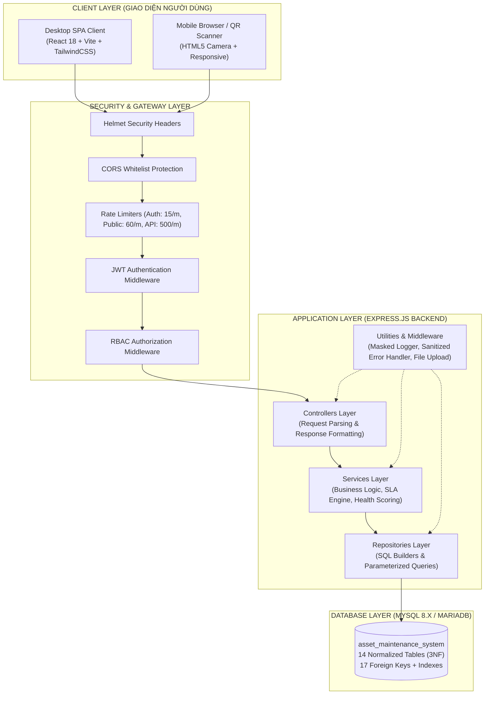
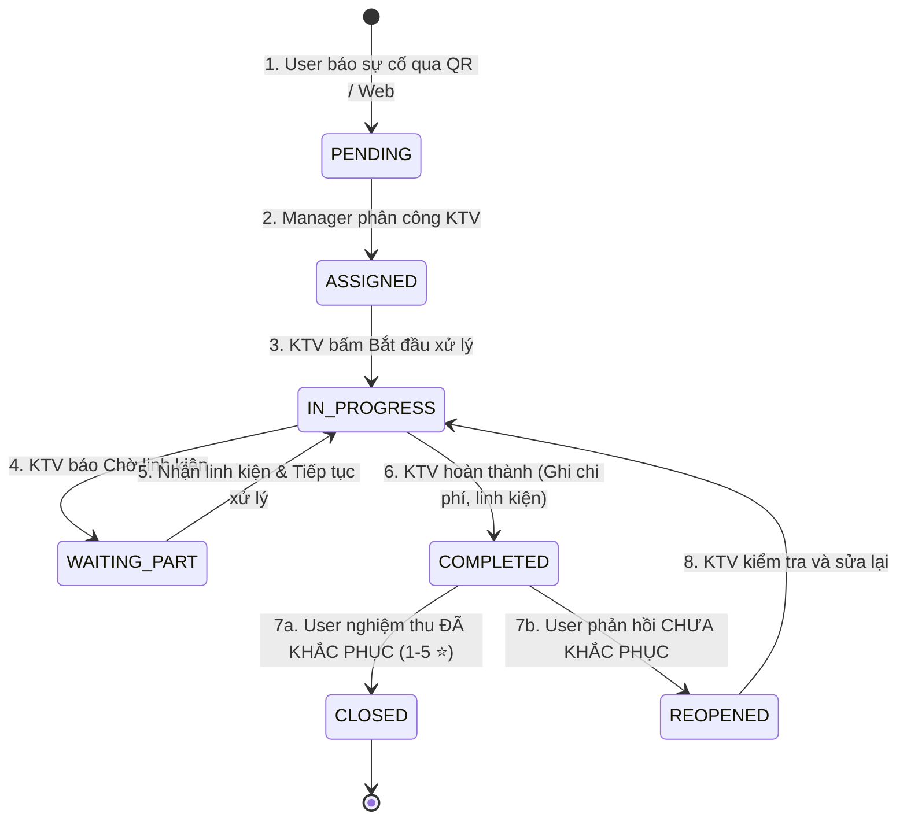

# TÀI LIỆU THIẾT KẾ KIẾN TRÚC HỆ THỐNG (SYSTEM ARCHITECTURE)
> **Software Architecture & Technical Design Document**

---

## 1. Mô Hình Kiến Trúc Tổng Thể (Overall Architecture)

Hệ thống được xây dựng theo mô hình **Kiến trúc Phân tầng 3 lớp (3-Tier Layered Architecture)** chuẩn doanh nghiệp kết hợp kiến trúc **RESTful API**:

---

## 2. Thiết Kế Các Tầng Ứng Dụng (Layered Design)

### A. Tầng Điều Khiển (Controllers Layer - `backend/src/controllers/`):
- Tiếp nhận HTTP Request, giải mã JSON Body, Query Parameters, Route Params.
- Ủy quyền xử lý nghiệp vụ cho Services Layer.
- Chuẩn hóa cấu trúc phản hồi thành công qua lớp tiện ích `ApiResponse.success(res, data, message, statusCode)`.

### B. Tầng Nghiệp Vụ (Services Layer - `backend/src/services/`):
- Chứa toàn bộ quy tắc nghiệp vụ (Business Rules) của hệ thống:
  - **SLA Engine**: Tính toán `due_at`, kiểm tra vé quá hạn `is_overdue`, cảnh báo sắp quá hạn `is_due_soon`.
  - **State Machine Engine**: Kiểm soát tính hợp lệ của bước chuyển trạng thái phiếu bảo trì (`validateStatusTransition`).
  - **Asset Health Scoring Engine**: Chấm điểm 0-100 dựa trên 7 chỉ số vận hành và trừ điểm theo mức độ nghiêm trọng.
  - **Notification Dispatcher**: Tự động gửi thông báo theo thời gian thực khi có sự kiện thay đổi trạng thái hoặc phân công công việc.

### C. Tầng Thao Tác Dữ Liệu (Repositories Layer - `backend/src/repositories/`):
- Tương tác trực tiếp với MySQL Connection Pool (`mysql2/promise`).
- Sử dụng **100% Prepared Statements (`pool.execute(sql, params)`)** để loại trừ hoàn toàn nguy cơ SQL Injection.
- Thực hiện các câu truy vấn tổng hợp phức tạp (Aggregation, Subqueries, Joins) cho Dashboard và Báo cáo.

---

## 3. Quy Trình Vòng Đời Phiếu Bảo Trì (State Machine Pattern)

---

## 4. Kiến Trúc Bảo Mật Đa Tầng (Multi-Layer Security Architecture)

Hệ thống triển khai 8 tầng bảo vệ vững chắc:
1. **Transport Security**: Hỗ trợ SSL/TLS HTTPS, HSTS, Secure Cookies.
2. **HTTP Headers Hardening**: Sử dụng `helmet` thiết lập CSP, X-Frame-Options, X-Content-Type-Options.
3. **DoS & Brute-Force Prevention**: Bộ lọc `express-rate-limit` đa vùng (Auth: 15 req/min, Public Scan: 60 req/min, API: 500 req/min).
4. **Stateless Authentication**: JWT Token ký bằng thuật toán HS256, thời hạn 7 ngày, secret key phân tách qua biến môi trường.
5. **Role-Based Access Control (RBAC)**: Kiểm tra phân quyền tại Middleware máy chủ cho từng Route.
6. **SQL Injection Defense**: 100% Parameterized Queries với MySQL Connection Pool.
7. **Input & File Upload Validation**: Joi Validation cho mọi Payload; Whitelist MIME Type & File Extension, Blacklist tệp thực thi độc hại (`.exe`, `.php`, `.sh`, `.bat`), mã hóa UUID tên file chống Path Traversal.
8. **Sensitive Information Protection**: Che giấu tự động mật khẩu, token, secret trong Logger và Error Handler; không bao giờ trả về trường `password_hash` trong API.
