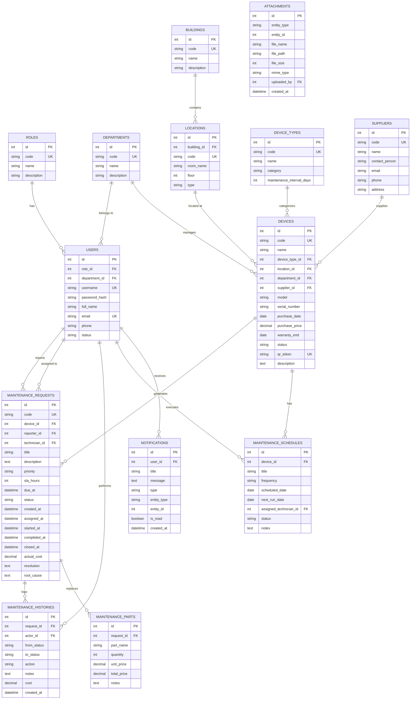

# THIẾT KẾ CƠ SỞ DỮ LIỆU (DATABASE SCHEMA & ERD)
> **Database Architecture, Entity-Relationship Diagram & Data Dictionary**

---

## 1. Sơ Đồ Thực Thể Quan Hệ (Entity-Relationship Diagram - ERD)

Cơ sở dữ liệu **`asset_maintenance_system`** được thiết kế đạt chuẩn chuẩn hóa **3NF (Third Normal Form)**, gồm 14 bảng quan hệ và 17 khóa ngoại bảo đảm toàn vẹn dữ liệu:

---

## 2. Từ Điển Dữ Liệu & Chỉ Mục Tối Ưu Hóa (Data Dictionary & Indexes)

### A. Bảng `devices` (Thiết bị)
- **Primary Key**: `id`
- **Unique Indexes**: `code`, `qr_token`
- **Secondary Indexes**: `device_type_id`, `location_id`, `department_id`, `status`
- **Mô tả trạng thái (`status`)**:
  - `ACTIVE`: Thiết bị đang hoạt động bình thường tại phòng học.
  - `MAINTENANCE`: Đang trong chu trình bảo dưỡng hoặc sửa chữa.
  - `BROKEN`: Thiết bị hỏng đang chờ kỹ thuật viên tiếp nhận xử lý.
  - `RETIRED`: Thiết bị đã thanh lý hoặc ngừng sử dụng (Khóa chặn tạo vé bảo trì mới).

### B. Bảng `maintenance_requests` (Phiếu yêu cầu bảo trì)
- **Primary Key**: `id`
- **Unique Indexes**: `code`
- **Secondary Indexes**: `device_id`, `reporter_id`, `technician_id`, `status`, `priority`, `due_at`
- **Mô tả trạng thái (`status`)**:
  - `PENDING`: Sự cố mới tạo, chờ Ban Quản lý phân công KTV.
  - `ASSIGNED`: Đã chỉ định KTV phụ trách.
  - `IN_PROGRESS`: KTV đã có mặt tại hiện trường và bắt đầu xử lý.
  - `WAITING_PART`: Tạm dừng chờ xuất kho linh kiện thay thế.
  - `COMPLETED`: KTV hoàn thành sửa chữa, chờ người dùng nghiệm thu.
  - `CLOSED`: Người dùng xác nhận đã khắc phục và đóng phiếu thành công.
  - `REOPENED`: Người dùng phản hồi chưa khắc phục đạt yêu cầu, mở lại vé.
