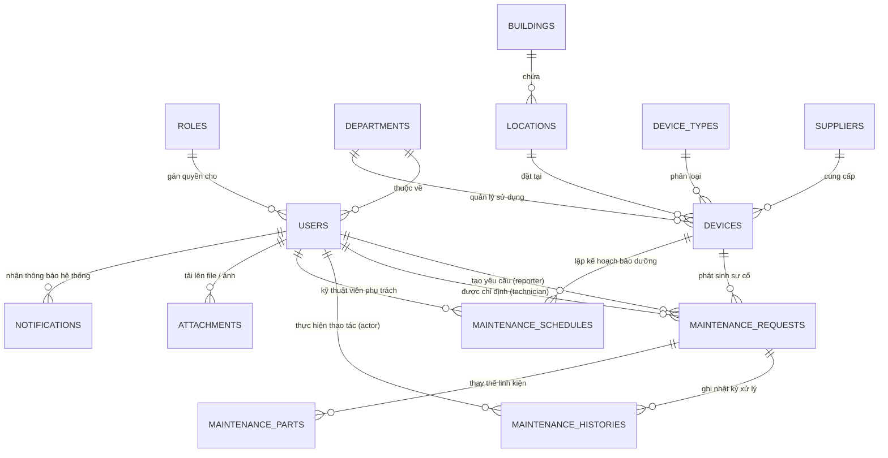

# Thiết Kế Cơ Sở Dữ Liệu & Sơ Đồ Quan Hệ Thực Thể (Database Schema & ERD)

Tên Cơ Sở Dữ Liệu: **`asset_maintenance_system`** (MySQL 8.0+)

---

## 1. Danh Mục 14 Bảng Dữ Liệu Chuẩn Hóa

| STT | Tên bảng | Chức năng chính | Khóa chính & Khóa ngoại |
| :--- | :--- | :--- | :--- |
| 1 | `roles` | 4 Vai trò hệ thống: `ADMIN`, `MANAGER`, `TECHNICIAN`, `USER` | `id` (PK) |
| 2 | `departments` | Danh mục Khoa, Phòng ban, Trung tâm trong trường đại học | `id` (PK) |
| 3 | `users` | 10 Tài khoản mẫu (Admin, Manager, 3 Technicians, 5 Users) | `id` (PK), `role_id` (FK), `department_id` (FK) |
| 4 | `buildings` | 3 Tòa nhà khuôn viên trường (`A1`, `B2`, `C3`) | `id` (PK) |
| 5 | `locations` | 10 Địa điểm/Phòng học (`A1-101`, `B2-301`, `C3-401`...) | `id` (PK), `building_id` (FK) |
| 6 | `device_types` | 10 Loại thiết bị (PC, Máy chiếu, Điều hòa, Switch...) | `id` (PK) |
| 7 | `suppliers` | 5 Nhà cung cấp chính hãng (Dell, Panasonic, Cisco, Daikin, Phong Vũ) | `id` (PK) |
| 8 | `devices` | 32 Thiết bị gắn mã QR token duy nhất (`qr_token`, `code`, `status`...) | `id` (PK), `device_type_id` (FK), `location_id` (FK), `department_id` (FK), `supplier_id` (FK) |
| 9 | `maintenance_requests` | Phiếu yêu cầu bảo trì (`reporter_id`, `technician_id`, `priority`, `status`, `actual_cost`...) | `id` (PK), `device_id` (FK), `reporter_id` (FK), `technician_id` (FK) |
| 10 | `maintenance_histories` | Nhật ký từng bước xử lý yêu cầu (`request_id`, `actor_id`, `from_status`, `to_status`...) | `id` (PK), `request_id` (FK), `actor_id` (FK) |
| 11 | `maintenance_schedules` | Kế hoạch bảo dưỡng định kỳ thiết bị | `id` (PK), `device_id` (FK), `assigned_technician_id` (FK) |
| 12 | `maintenance_parts` | Linh kiện phụ tùng thay thế và đơn giá tự động tính `total_price` | `id` (PK), `request_id` (FK) |
| 13 | `notifications` | Thông báo tự động gửi người dùng | `id` (PK), `user_id` (FK) |
| 14 | `attachments` | Tệp đính kèm và hình ảnh hiện trạng trước/sau sửa chữa | `id` (PK), `uploaded_by` (FK) |

---

## 2. Sơ Đồ Thực Thể Liên Kết (Mermaid ERD)

---

## 3. Chi Tiết Cấu Trúc Bảng Cốt Lõi

### Bảng `devices`:
- `id` (INT, PK, AUTO_INCREMENT)
- `code` (VARCHAR(50), UNIQUE)
- `name` (VARCHAR(150))
- `device_type_id` (INT, FK -> `device_types.id`)
- `location_id` (INT, FK -> `locations.id`)
- `department_id` (INT, FK -> `departments.id`, NULLABLE)
- `supplier_id` (INT, FK -> `suppliers.id`, NULLABLE)
- `model` (VARCHAR(100))
- `serial_number` (VARCHAR(100))
- `purchase_date` (DATE)
- `purchase_price` (DECIMAL(15,2))
- `warranty_start` (DATE)
- `warranty_end` (DATE)
- `status` (ENUM: `ACTIVE`, `MAINTENANCE`, `BROKEN`, `RETIRED`)
- `description` (TEXT)
- `qr_token` (VARCHAR(255), UNIQUE)
- `created_at` (TIMESTAMP)
- `updated_at` (TIMESTAMP)

### Bảng `maintenance_requests`:
- `id` (INT, PK, AUTO_INCREMENT)
- `code` (VARCHAR(50), UNIQUE)
- `device_id` (INT, FK -> `devices.id`)
- `reporter_id` (INT, FK -> `users.id`)
- `technician_id` (INT, FK -> `users.id`, NULLABLE)
- `title` (VARCHAR(200))
- `description` (TEXT)
- `priority` (ENUM: `LOW`, `MEDIUM`, `HIGH`, `URGENT`)
- `status` (ENUM: `PENDING`, `ASSIGNED`, `IN_PROGRESS`, `WAITING_PART`, `COMPLETED`, `CLOSED`, `REOPENED`)
- `created_at` (TIMESTAMP)
- `assigned_at` (TIMESTAMP, NULLABLE)
- `started_at` (TIMESTAMP, NULLABLE)
- `completed_at` (TIMESTAMP, NULLABLE)
- `closed_at` (TIMESTAMP, NULLABLE)
- `estimated_cost` (DECIMAL(15,2))
- `actual_cost` (DECIMAL(15,2))
- `resolution` (TEXT, NULLABLE)
- `root_cause` (TEXT, NULLABLE)
- `updated_at` (TIMESTAMP)
